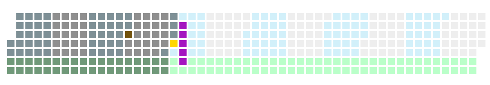
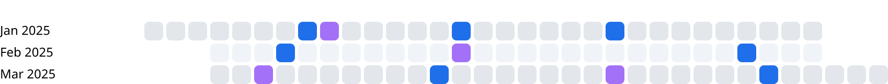
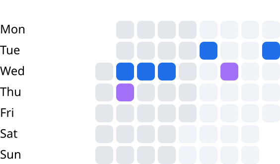
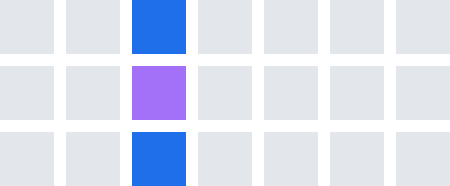
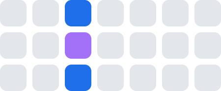
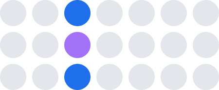
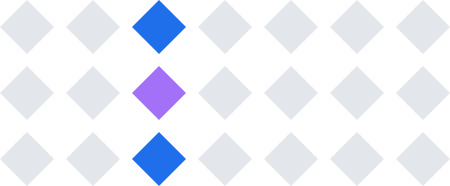
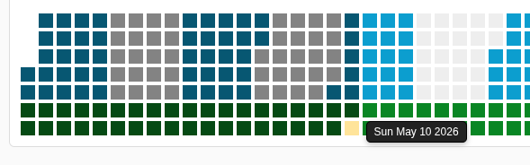
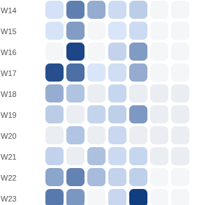

# Daytiles

Snippet for visualizing date ranges as grids of tiles (Github syle)  One tile per day. Useful to visualize long ranges of days,  


Configurable layout, shape, colors, and events. No dependencies, renders to plain SVG.


[**See the Live examples →**](https://chamartin3.github.io/daytiles/examples/)



## Contents

- [Install](#install)
- [Configuration](#configuration)
  - [Layouts](#layouts)
  - [Shapes](#shapes)
  - [Sizing](#sizing)
  - [Date range](#date-range)
  - [Colors](#colors)
  - [Highlights](#highlights)
- [Events](#events)
- [Interactivity](#interactivity)
- [Updating](#updating)
- [Full schema](#full-schema)
- [License](#license)

## Install

This package is not published to npm. Install it directly from GitHub:

```bash
npm install github:Chamartin3/daytiles
```

Or pin a specific commit / tag:

```bash
npm install github:Chamartin3/daytiles#main
```

With a bundler (Vite, webpack, esbuild, etc.):

```js
import { Daytiles, Layout, Shape } from "daytiles";
import "daytiles/styles.css";
```

In a plain HTML page, declare an importmap pointing at the package's ESM build:

```html
<!doctype html>
<link rel="stylesheet" href="./node_modules/daytiles/styles.css" />
<svg id="calendar"></svg>
<script type="importmap">
  { "imports": { "daytiles": "./node_modules/daytiles/dist/index.js" } }
</script>
<script type="module">
  import { Daytiles, Layout, Shape } from "daytiles";

  const dt = new Daytiles({
    layout: Layout.Month,
    shape: Shape.RoundedRect,
    startDate: "2025-01-01",
    endDate: "2025-12-31",
  });

  dt.addEvents([
    { start: "2025-03-15", color: "#ff5577", note: "Launch" },
    { start: "2025-07-01", end: "2025-07-14", type: "vacation" },
  ]);

  dt.render(document.getElementById("calendar"));
</script>
```

The library auto-sizes the SVG to fit the rendered grid and makes it responsive.

### Building from source

If you change the TypeScript sources, rebuild `dist/`:

```bash
npm install
npm run build
```

## Configuration

All options are passed to the `Daytiles` constructor or `update()`.

### Layouts

```js
{ layout: Layout.Month }
```

How days are arranged into rows.

#### `Layout.Month`

One row per calendar month. Best for multi-month or multi-year ranges.



#### `Layout.Week`

One row per ISO week. Best for ~3-12 month ranges.


#### `Layout.Weekday`

Columns are weekdays, rows accumulate weeks (GitHub-style heatmap).



#### `Layout.Custom`

Fixed `daysPerRow` count. Use for arbitrary widths regardless of weeks.


### Shapes

```js
{ shape: Shape.RoundedRect }
```

Each tile can be drawn as one of four shapes.

| Shape               | Preview                             | Description                  |
| ------------------- | ----------------------------------- | ---------------------------- |
| `Shape.Rect`        |     | Square (default).            |
| `Shape.RoundedRect` |  | Square with rounded corners. |
| `Shape.Circle`      |   | Circle.                      |
| `Shape.Diamond`     |  | 45°-rotated square.          |

### Sizing

```js
{
  daySize: 16,
  gap: 4,
  daysPerRow: 21,
  startDayOfWeek: 1,
  showLabels: true,
  labelWidth: 56,
}
```

| Option           | Type    | Description                                     |
| ---------------- | ------- | ----------------------------------------------- |
| `daySize`        | number  | Tile size in px.                                |
| `gap`            | number  | Spacing between tiles in px.                    |
| `daysPerRow`     | number  | Used only when `layout: Layout.Custom`.         |
| `startDayOfWeek` | number  | 0 = Sunday, 1 = Monday. Affects week alignment. |
| `showLabels`     | boolean | Show row labels (month/week names).             |
| `labelWidth`     | number  | Reserved width for labels in px.                |

### Date range

```js
{
  startDate: "2025-01-01",
  endDate: "2025-12-31",
}
```

| Option      | Type               | Description                                    |
| ----------- | ------------------ | ---------------------------------------------- |
| `startDate` | `string` or `Date` | ISO `YYYY-MM-DD` string, or a `Date` instance. |
| `endDate`   | `string` or `Date` | Inclusive end of the range.                    |

### Colors

The `colors` object groups all visual settings:

```js
colors: {
  current: "#FFD700",       // today's tile
  dayColor: "#eee",         // base tile color
  pastFade: 0.6,            // brightness multiplier for past days (omit to disable)
  futureFade: 1,            // brightness multiplier for future days
  highlightCurrent: true,   // highlight today with `current` color
  defaultEventColor: "#ff5577",
  eventTypeColors: {        // map event.type → color
    work: "#3c3b6e",
    vacation: "#34c759",
  },
  alternation: {
    mode: AlternationMode.Month,  // alternate background per bucket
    color: "#d2f0fa",
    size: 7,                       // only used in Custom mode
  },
  highlight: {
    weekdays: { 0: "#fee", 6: "#fee" },  // 0 = Sunday
    months: { 11: "#fef" },               // 11 = December
  },
}
```

#### Highlights



Tiles are colored by layering several rules. Higher rules win when they apply:

1. **Today** — when `highlightCurrent: true`, today's tile uses `current`.
2. **Weekday / month highlights** — `highlight.weekdays[dayOfWeek]` and `highlight.months[monthIndex]` paint specific weekdays or months. Use this for weekend stripes, holiday months, etc.
3. **Alternation** — `alternation` paints alternating buckets (every other day, week, month, year, or every `size` days in `Custom`) with `alternation.color`. Useful to imply structure without labels.
4. **Base color** — every other tile falls back to `dayColor`.
5. **Past / future fade** — after the color above is picked, `pastFade` dims tiles before today and `futureFade` dims tiles after. Both are brightness multipliers in `0..1` (omit to disable).
6. **Events** — events draw on top of the base tile using `event.color`, `eventTypeColors[event.type]`, or `defaultEventColor`. With `heatmap: true`, the tile is tinted by event count between `heatmapLow` and `heatmapHigh` instead.

##### Alternation modes

`AlternationMode` picks which buckets get the alternation color:

- `None`: disabled
- `Day`: every other day
- `Week`: every other ISO week
- `Month`: every other month
- `Year`: every other calendar year (useful for multi-year ranges)
- `Custom`: every `size` days

## Events

Events mark individual days or date ranges. Each event has a `start`, optional `end`, and either an explicit `color` or a `type` resolved through `colors.eventTypeColors`.

```js
dt.addEvent({ start: "2025-03-15", color: "#ff0000", note: "Release" });
dt.addEvents([
  { start: "2025-04-01", end: "2025-04-07", type: "vacation" },
  { start: "2025-05-20", color: "#0066cc", note: "Demo", wiki: "Demo_(disambiguation)" },
]);
```

| Method                  | Returns                  |
| ----------------------- | ------------------------ |
| `addEvent(event)`       | event id                 |
| `addEvents(events)`     | array of event ids       |
| `prependEvent(event)`   | event id (rendered last) |
| `prependEvents(events)` | array of event ids       |
| `removeEvent(id)`       | boolean                  |
| `clearEvents()`         | void                     |
| `listEvents()`          | array of stored events   |

Events are stacked in insertion order. When two events overlap, the first one inserted wins for color; notes accumulate joined by ` • `.

### Typed events vs. heatmap

Events drive two different visualizations, controlled from `colors`:

- **Typed events (default)** — each event paints its tile with `event.color`, `eventTypeColors[event.type]`, or `defaultEventColor`. Use this when each event has a meaningful identity (releases, holidays, deploys).
- **Heatmap mode** — set `colors.heatmap: true` and the tile is tinted by event *count* between `heatmapLow` and `heatmapHigh`. Event color is ignored; what matters is how many events fall on the day. Use this for activity intensity (commits, sales, calls).

```js
colors: {
  heatmap: true,
  heatmapLow: 0.15,   // lightest tint
  heatmapHigh: 0.45,  // darkest tint
  defaultEventColor: "#1f6feb", // hue used for the gradient
}
```



## Interactivity

```js
dt.onTileClick(({ date, event }) => {
  console.log(date.toDateString(), event.note);
});
```

The handler receives the clicked `Date` and the `EventInfo` (which may be empty if the day has no event).

## Updating

Call `update()` to change settings without re-creating the instance, then `render()` again:

```js
dt.update({ layout: Layout.Week, daySize: 20 });
dt.render(svgElement);
```


## Full schema

Every option accepted by the constructor or `update()`:

```ts
interface CalendarSettings {
  layout: Layout;             // Layout.Month | Week | Weekday | Custom
  shape: Shape;               // Shape.Rect | RoundedRect | Circle | Diamond
  startDate: string | Date;   // ISO "YYYY-MM-DD" or Date
  endDate: string | Date;
  year: number | null;        // Override year used when start/end omit one
  daySize: number;            // Tile size in px
  gap: number;                // Spacing between tiles in px
  startDayOfWeek: number;     // 0 = Sunday, 1 = Monday
  daysPerRow: number;         // Used only with Layout.Custom
  showLabels: boolean;        // Show row labels (month/week names)
  labelWidth: number;         // Reserved width for labels in px
  events: Record<string, EventInfo[]>; // Pre-seeded events by ISO date
  colors: ColorSettings;
}

interface ColorSettings {
  current: string;                       // Today's tile color
  dayColor: string;                      // Base tile color
  pastFade?: number;                     // Brightness multiplier for past days
  futureFade?: number;                   // Brightness multiplier for future days
  highlightCurrent?: boolean;            // Highlight today with `current`
  defaultEventColor: string;             // Fallback color for events
  eventTypeColors?: Record<string,string>; // event.type → color
  alternation: {
    mode: AlternationMode;               // None | Day | Week | Month | Year | Custom
    color: string;
    size: number;                        // Bucket size for Custom mode
  };
  highlight?: {
    weekdays?: Record<number, string>;   // 0 = Sunday … 6 = Saturday
    months?: Record<number, string>;     // 0 = January … 11 = December
  };
  heatmap?: boolean;                     // Tint tiles by event count
  heatmapLow?: number;                   // Min tint intensity (0-1)
  heatmapHigh?: number;                  // Max tint intensity (0-1)
}

interface EventInfo {
  start: string | Date;
  end?: string | Date;
  color?: string;
  type?: string;                         // Resolved via eventTypeColors
  note?: string;
  wiki?: string;
}
```

## License

MIT.
